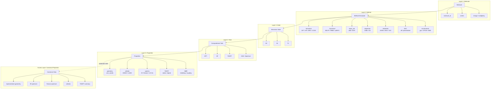
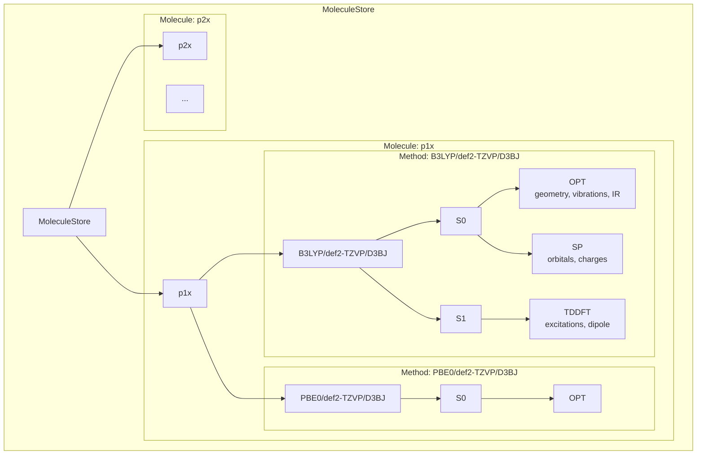

# ORCA Computational Chemistry Data Architecture

*A scientifically correct and ergonomically usable architecture for ORCA computational chemistry data.*

---

## Overview

This document defines a **conceptual data architecture** for handling results produced by **ORCA quantum chemistry calculations**.

The goal is to ensure that:

* Results are never overwritten
* Comparisons between methods are scientifically valid
* Data remains easy to access for everyday analysis
* Workflows scale to many methods, states, and properties
* Usage matches how chemists actually think and work

---

## Core Principle

> **ORCA does not produce files — it produces solutions to Hamiltonians under specific approximations.**

The same molecule can be computed using different functionals, basis sets, dispersion corrections, solvents, and relativistic treatments. Even if the filename is similar, the electronic state label is the same (e.g. S0), and the task is the same (OPT, SP) — **the physics is different**.

Any data model that collapses these results risks:
* Silent overwriting
* Invalid comparisons
* Irreproducible conclusions

---

## Fundamental Truth

> **ORCA method identity is composite, not atomic.**

There is no single keyword in ORCA that defines a "method". Method identity emerges from *multiple independent choices* spread across the manual.

---

## The Five Architectural Layers

### Layer 1 — Molecule (Chemical Identity)

Answers: *What chemical system is this?*

* Stoichiometry
* Connectivity
* Charge and multiplicity (as chemical context)

**A molecule exists independently of how it is computed.**

---

### Layer 2 — Method (Hamiltonian Definition)

Answers: *What Hamiltonian is being solved?*

A method is defined by a **composite descriptor**:

| Dimension | Examples |
|-----------|----------|
| Electronic formalism | DFT, HF, MP2, CCSD, CASSCF |
| Wavefunction type | RKS, UKS, RHF, UHF, ROKS |
| XC functional | B3LYP, ωB97X, PBE0 |
| Dispersion model | none, D3BJ, D4, VV10 |
| Orbital basis set | def2-SVP, def2-TZVP, def2-QZVP |
| Core treatment | all-electron, frozen core, ECP |
| Relativistic Hamiltonian | none, ZORA, DKH, X2C |
| Spin–orbit treatment | off, perturbative, variational |
| Environment | gas phase, CPCM/SMD, QM/MM |

> **Changing any of these creates a new method.**

---

### Layer 3 — State (Solution of the Hamiltonian)

Answers: *Which solution of the Hamiltonian are we looking at?*

* S0, S1, T1, higher excited roots
* A state **cannot exist without a method**
* S0 from one method ≠ S0 from another

---

### Layer 4 — Task / Context

Answers: *How was this state treated computationally?*

* OPT (geometry optimization)
* SP (single point)
* TDDFT
* SOC-corrected TDDFT
* ESD / spectrum calculation

> **Tasks do not define methods.** They define *how a state was explored*.

---

### Layer 5 — Properties (Observables)

Answers: *What observables were derived from this solution?*

* Energies
* Orbitals
* IR / Raman spectrum
* TDDFT transitions
* Charges, NMR parameters

---

## ORCA Data Hierarchy Graph

### Architectural Layers



### Hierarchical Storage Structure



### Text Representation

```
Molecule
│
├── Identity
│   ├── stoichiometry
│   ├── connectivity
│   └── charge / multiplicity
│
├── Methods
│   │
│   ├── Method_ID
│   │   ├── Method Descriptor
│   │   │   ├── formalism (DFT, CCSD, …)
│   │   │   ├── wavefunction (RKS, UKS, …)
│   │   │   ├── functional
│   │   │   ├── dispersion
│   │   │   ├── basis set
│   │   │   ├── relativistic model
│   │   │   ├── SOC treatment
│   │   │   └── environment
│   │   │
│   │   └── States
│   │       ├── S0
│   │       │   ├── OPT → geometry, vibrations
│   │       │   └── SP  → orbitals, IR, Raman
│   │       ├── S1 → TDDFT properties
│   │       └── T1 → OPT / SP
│   │
│   └── Other Methods …
│
└── Canonical Projection (ACCESS LAYER)
    ├── representative geometry
    ├── IR spectrum
    ├── Raman spectrum
    ├── orbitals
    └── TDDFT summary
```

---

## Storage vs Access Architecture

### Storage (Truth Layer)

Internally, data **must** preserve:
* All methods
* All states
* All tasks
* Full provenance

This guarantees reproducibility and valid comparisons.

---

### Access (Ergonomics Layer)

Real analysis wants:
* "What is the IR spectrum of this molecule?"
* "Show the Raman correlations"
* "Plot the orbitals"

**Not:**
* "Which basis?"
* "Which dispersion?"
* "Which SOC treatment?"

*Unless explicitly comparing.*

---

## Canonical Projection

Projection is the **intentional, lossless simplification**:

* Select a representative method (prefer S0, optimized geometry)
* Expose its properties as the molecule's default view
* Keep all other data intact underneath

This mirrors **experimental chemistry**:
* One IR spectrum per compound
* One Raman spectrum per compound
* One structure per compound

Even if many measurements exist.

---

## When Projection Must Be Overridden

Explicit method/state selection is needed for:

* Benchmarking studies
* Basis-set convergence
* Solvent comparison
* SOC vs non-SOC analysis
* Excited-state reordering

These are **advanced workflows** requiring **explicit intent**.

---

## Scientific Usage Examples

### Example 1 — IR & Raman Analysis

> "What is the IR–Raman correlation of compound X?"

✔ Uses canonical projection  
✔ No method selection required  
✔ Matches experimental practice

---

### Example 2 — Basis Set Convergence

> "Does def2-SVP vs def2-TZVP change frequencies?"

✔ Same molecule, same state  
✔ Explicit method comparison

---

### Example 3 — TDDFT Benchmarking

> "How do excitation energies change across functionals?"

✔ Fixed geometry  
✔ Multiple methods  
✔ Explicit state tracking

---

## Architectural Principles

1. **ORCA method identity is composite**
2. **Filenames are never identity**
3. **States are never identity**
4. **Tasks are never identity**
5. **Storage must reflect physics**
6. **Access must reflect scientific thinking**
7. **Projection is mandatory, not optional**
8. **Method awareness must be opt-in**
9. **Reproducibility requires method separation**
10. **Usability is part of correctness**

---

## Design Guarantees

If followed correctly, this architecture guarantees:

* ✅ No silent data loss
* ✅ No invalid comparisons
* ✅ Full reproducibility
* ✅ Scalable workflows
* ✅ Notebook-friendly analysis
* ✅ Paper-ready provenance

---

## What This Architecture Does NOT Do

* ❌ Does not enforce a database
* ❌ Does not mandate an API
* ❌ Does not limit ORCA features
* ❌ Does not simplify physics

It **only** enforces correct relationships.

---

## Paper-Style Methods Section

> **Data Model and Computational Provenance**
>
> All ORCA computational results were organized using a molecule-centric data architecture in which molecular identity is separated from computational method, electronic state, and calculated properties. Each computational method is uniquely defined by its electronic formalism, wavefunction representation, exchange–correlation functional, dispersion correction, basis set, relativistic treatment, and environmental model. Electronic states (e.g., S0, S1, T1) are treated as method-dependent solutions of the corresponding Hamiltonian.
>
> Computational tasks such as geometry optimization, single-point evaluation, and time-dependent DFT calculations are treated as contextual operations on these states rather than as defining characteristics of the method.
>
> For routine analysis and visualization, a canonical projection was employed to expose representative molecular properties (e.g., IR and Raman spectra) while retaining full access to method-resolved data for benchmarking and comparison.

---

## Contributor Guidelines

### Non-Negotiable Rules

* ❌ Never overwrite results across methods
* ❌ Never use filenames as identity
* ❌ Never treat states as unique identifiers
* ❌ Never hide method provenance

### Encouraged Extensions

* ✔ Add new methods freely
* ✔ Add new spectroscopy types
* ✔ Add new relativistic treatments
* ✔ Add new properties

As long as **Molecule → Method → State → Task → Properties** is preserved.

---

*This architecture is explicitly aligned with ORCA's internal logic, best practices in the literature, and how chemists actually analyze data.*
