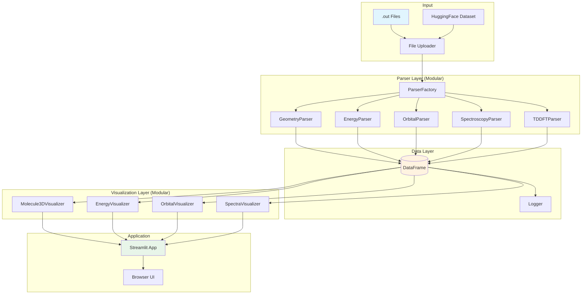

# ORCA Quantum Chemistry Visualization Platform

**An interactive Python-based parser and visualization system for ORCA quantum chemistry output files.**

> **Stack**: Streamlit + Plotly + py3Dmol | **Deployment**: Local | **User**: Single-user project

---

## 📋 Project Overview

| Component | Technology | Status |
|-----------|------------|--------|
| **Parser** | Python, regex, pandas | 🔄 Refactoring |
| **Visualization** | Plotly, py3Dmol | ⏳ Migration |
| **Web UI** | Streamlit | ⏳ Planned |
| **Logging** | Python logging | ⏳ Planned |

---

## 🏗️ System Architecture



---

## 📁 Project Structure

```
Orca_Files/
├── README.md
├── requirements.txt
├── app.py                      # Streamlit entry point
│
├── src/
│   ├── __init__.py
│   ├── logger.py               # Centralized logging config
│   │
│   ├── parser/                 # Modular parsers by data type
│   │   ├── __init__.py
│   │   ├── base.py             # BaseParser abstract class
│   │   ├── factory.py          # ParserFactory
│   │   ├── geometry.py         # Coordinates, SMILES
│   │   ├── energy.py           # Gibbs, single-point
│   │   ├── orbitals.py         # HOMO/LUMO, spin orbitals
│   │   ├── spectroscopy.py     # IR, Raman, NMR
│   │   ├── tddft.py            # TD-DFT states
│   │   ├── dipole.py           # Electric/velocity dipole
│   │   └── batch.py            # Multi-file processing
│   │
│   ├── viz/                    # Modular visualizers by data type
│   │   ├── __init__.py
│   │   ├── base.py             # BaseVisualizer
│   │   ├── molecule_3d.py      # py3Dmol + Plotly 3D
│   │   ├── energy_diagram.py   # Plotly energy pathways
│   │   ├── orbital_plot.py     # Plotly orbital diagrams
│   │   └── spectra_plot.py     # Plotly IR/Raman/UV-Vis
│   │
│   └── utils/
│       ├── __init__.py
│       ├── converters.py       # Unit conversions
│       └── validators.py       # Input validation
│
├── tests/
│   ├── __init__.py
│   ├── test_parsers.py         # Parser tests with output
│   ├── test_visualizations.py
│   └── test_data/
│       └── *.out               # Sample files
│
├── notebooks/
│   ├── 01_parser_demo.ipynb    # Parser test with output display
│   └── 02_viz_demo.ipynb       # Visualization demos
│
└── legacy/                     # Original notebooks (reference)
    ├── orca_praser.py
    ├── 0cbz_2026.ipynb
    └── ORCA_Test_v2.ipynb
```

---

## � Modular Parser Design

### Data Type → Parser Mapping

| Data Type | Parser Module | Output Fields |
|-----------|---------------|---------------|
| Geometry | `geometry.py` | `cart_coords`, `internal_coords`, `smiles` |
| Energy | `energy.py` | `gibbs_Eh`, `single_point_Eh` |
| Orbitals | `orbitals.py` | `orbitals` (DataFrame with HOMO/LUMO) |
| IR/Raman | `spectroscopy.py` | `ir_spectrum`, `raman_spectrum` |
| NMR | `spectroscopy.py` | `nmr_shielding`, `nmr_coupling` |
| TD-DFT | `tddft.py` | `tddft_states`, `transitions` |
| Dipole | `dipole.py` | `electric_dipole`, `velocity_dipole` |

### Parser Base Class

```python
# src/parser/base.py
from abc import ABC, abstractmethod
import logging

class BaseParser(ABC):
    def __init__(self, text: str):
        self.text = text
        self.logger = logging.getLogger(self.__class__.__name__)
    
    @abstractmethod
    def parse(self) -> dict:
        """Parse text and return data dict."""
        pass
    
    def _log_result(self, result: dict):
        self.logger.info(f"Parsed {len(result)} fields")
```

### Parser Factory

```python
# src/parser/factory.py
class ParserFactory:
    """Create and run all parsers on ORCA output."""
    
    def parse_file(self, filepath: str) -> dict:
        with open(filepath) as f:
            text = f.read()
        
        result = {}
        for parser_cls in [GeometryParser, EnergyParser, ...]:
            parser = parser_cls(text)
            result.update(parser.parse())
        
        return result
```

---

## 📊 Modular Visualization Design

### Data Type → Visualizer Mapping

| Data Type | Visualizer | Plot Type |
|-----------|------------|-----------|
| Geometry | `molecule_3d.py` | py3Dmol + Plotly 3D scatter |
| Energy | `energy_diagram.py` | Plotly bar/line with pathways |
| Orbitals | `orbital_plot.py` | Plotly horizontal bars |
| Spectra | `spectra_plot.py` | Plotly line plots |

### Visualizer Base Class

```python
# src/viz/base.py
from abc import ABC, abstractmethod
import plotly.graph_objects as go
import logging

class BaseVisualizer(ABC):
    def __init__(self, data):
        self.data = data
        self.logger = logging.getLogger(self.__class__.__name__)
    
    @abstractmethod
    def create_figure(self) -> go.Figure:
        """Create and return Plotly figure."""
        pass
```

---

## � Logging Configuration

```python
# src/logger.py
import logging
import sys

def setup_logging(level=logging.INFO):
    logging.basicConfig(
        level=level,
        format='%(asctime)s | %(name)s | %(levelname)s | %(message)s',
        handlers=[
            logging.StreamHandler(sys.stdout),
            logging.FileHandler('orca_viz.log')
        ]
    )
    return logging.getLogger('orca_viz')
```

### Log Levels

| Level | Use Case |
|-------|----------|
| DEBUG | Parsing regex matches, raw data |
| INFO | File parsed, figure created |
| WARNING | Missing data, fallback used |
| ERROR | Parse failed, invalid file |

---

## 🤗 HuggingFace Sample Data

```python
from huggingface_hub import snapshot_download
from pathlib import Path

# Download sample data
snapshot_download(
    repo_id="JauharMz/Orca",
    repo_type="dataset",
    local_dir="./data",
    local_dir_use_symlinks=False
)

# Parse all files
from src.parser.batch import BatchParser
parser = BatchParser()
df = parser.parse_folder("./data")
```

---

## 🧪 Testing Strategy

### Priority 1: Parser Tests with Output

```python
# tests/test_parsers.py
def test_geometry_parser():
    parser = GeometryParser(sample_text)
    result = parser.parse()
    
    # Display output for verification
    print("=== GEOMETRY OUTPUT ===")
    print(f"Atoms: {len(result['cart_coords'])}")
    print(f"SMILES: {result['smiles']}")
    print(result['cart_coords'].head())
    
    assert 'cart_coords' in result
    assert result['smiles'] is not None
```

### Test Execution

```bash
# Run with verbose output
pytest tests/test_parsers.py -v -s

# Show print statements
pytest tests/ --capture=no
```

---

## 🚀 Development Roadmap

### Sprint 1: Parser Refactoring (Priority ⭐⭐⭐)
- [ ] Create modular parser structure
- [ ] Add logging to all parsers
- [ ] Write tests with output display
- [ ] Verify parsed data in notebook

### Sprint 2: Visualization Migration
- [ ] Convert matplotlib → Plotly
- [ ] Implement py3Dmol viewer
- [ ] Create modular visualizers
- [ ] Test in Colab

### Sprint 3: Streamlit App
- [ ] Build file upload UI
- [ ] Connect visualizations
- [ ] Add molecule selector
- [ ] Local deployment

### Sprint 4: Polish
- [ ] Integration tests
- [ ] Documentation
- [ ] Performance tuning

---

## ⚙️ Quick Start

### Local Development

```bash
# Install
pip install -r requirements.txt

# Run Streamlit app
streamlit run app.py

# Run tests with output
pytest tests/ -v -s
```

### Google Colab

[](https://colab.research.google.com/github/jauharmz/Orca_Files/blob/main/ORCA_Test_v2.ipynb)

---

## 📦 Requirements

```txt
# requirements.txt
pandas>=2.0
numpy>=1.24
plotly>=5.18
streamlit>=1.30
py3Dmol>=2.0
rdkit>=2023.09
openbabel>=3.1
huggingface_hub>=0.20
```

---

*Last Updated: 2026-01-02*
