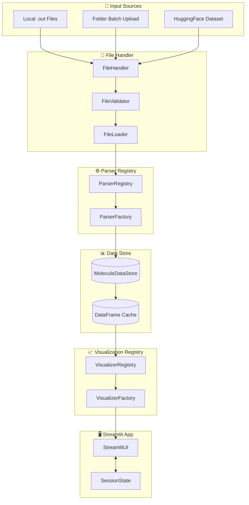
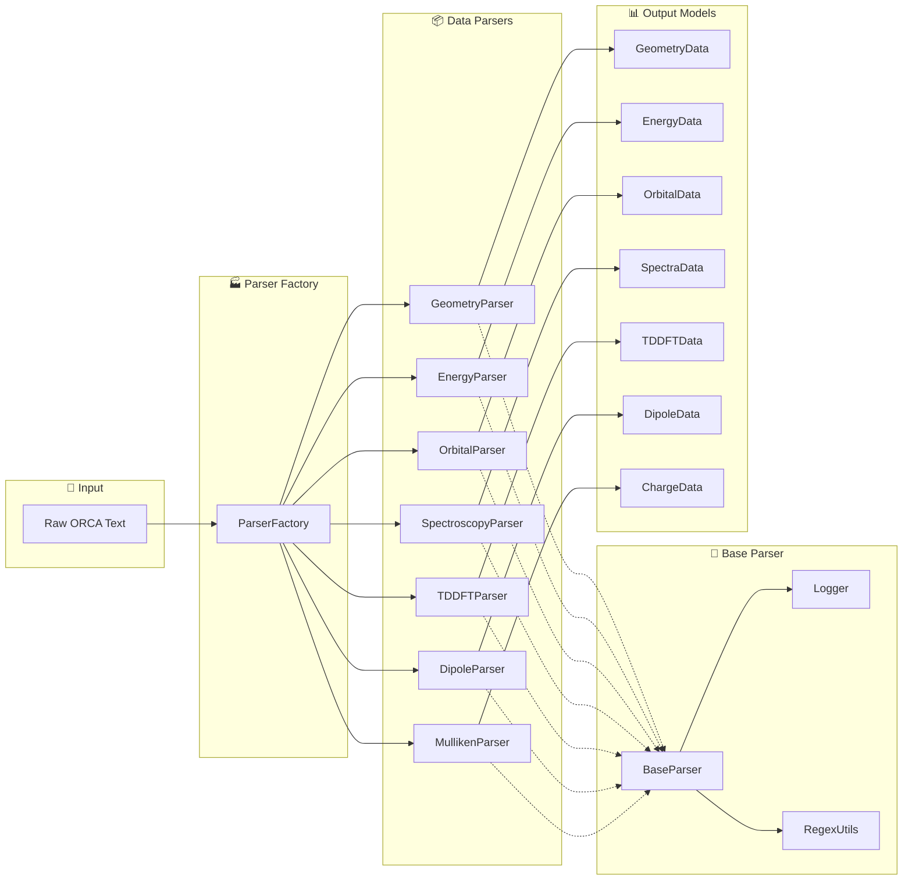
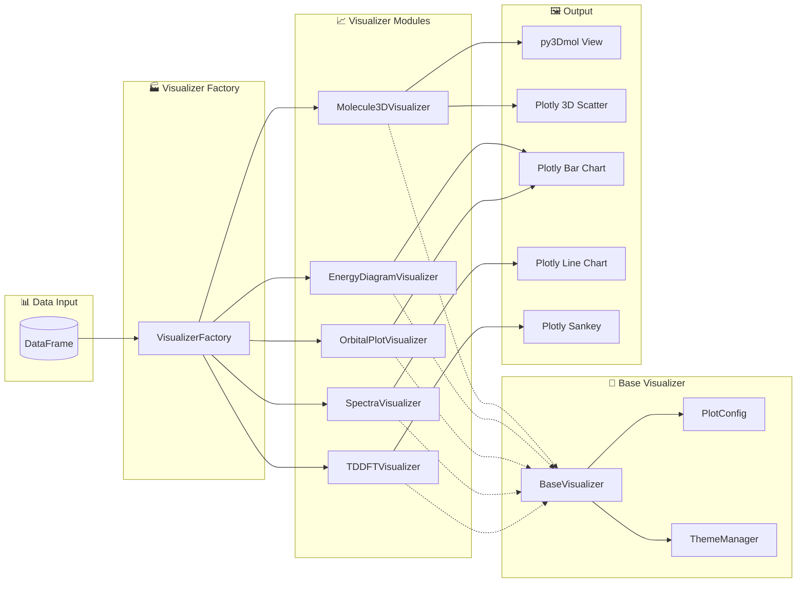
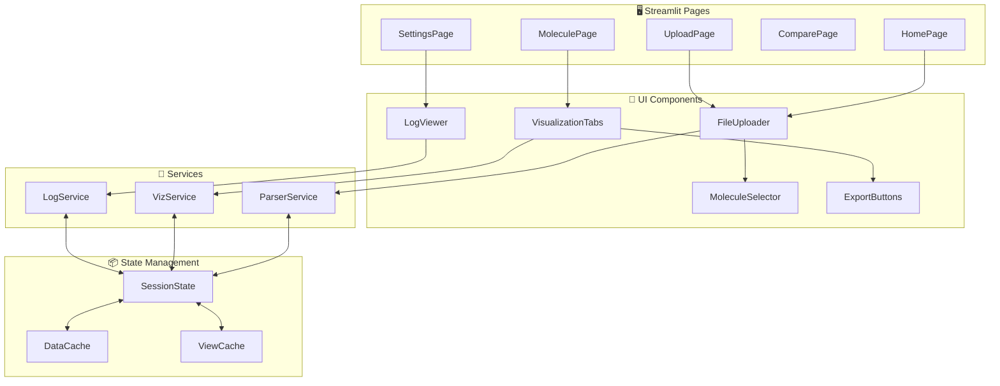
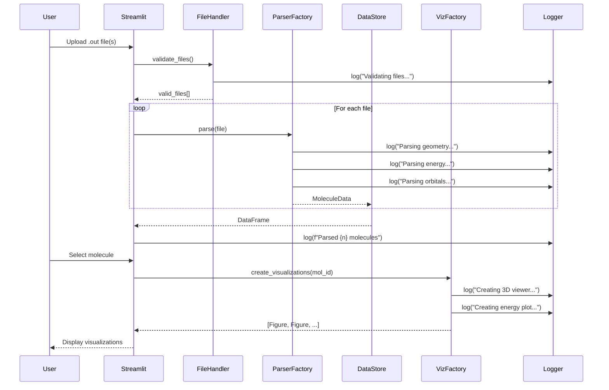

# ORCA Quantum Chemistry Visualization Platform

**An interactive Python-based parser and visualization system for ORCA quantum chemistry output files.**

> **Stack**: Streamlit + Plotly + py3Dmol | **Deployment**: Local | **User**: Single-user project

---

## 📋 Project Overview

| Component | Technology | Status |
|-----------|------------|--------|
| **Parser** | Python, regex, pandas | 🔄 Refactoring |
| **Visualization** | Plotly, py3Dmol | ⏳ Migration |
| **Web UI** | Streamlit | ⏳ Planned |
| **Logging** | Python logging | ⏳ Planned |

---

## 🏗️ System Architecture

### High-Level Overview



---

### Parser Module Architecture



---

### Visualization Module Architecture



---

### Streamlit App Architecture



---

### Data Flow Architecture



---

## 📁 Project Structure

```
Orca_Files/
├── README.md
├── requirements.txt
├── app.py                          # Streamlit entry point
│
├── src/
│   ├── __init__.py
│   ├── config.py                   # Configuration constants
│   ├── logger.py                   # Centralized logging
│   │
│   ├── core/                       # Core abstractions
│   │   ├── __init__.py
│   │   ├── base_parser.py          # Abstract parser
│   │   ├── base_visualizer.py      # Abstract visualizer
│   │   ├── data_models.py          # Pydantic/dataclass models
│   │   └── exceptions.py           # Custom exceptions
│   │
│   ├── parser/                     # Modular parsers
│   │   ├── __init__.py
│   │   ├── registry.py             # Parser registration
│   │   ├── factory.py              # ParserFactory
│   │   ├── geometry.py             # Coords, SMILES
│   │   ├── energy.py               # Gibbs, single-point
│   │   ├── orbitals.py             # HOMO/LUMO, spin
│   │   ├── spectroscopy.py         # IR, Raman, NMR
│   │   ├── tddft.py                # TD-DFT states
│   │   ├── dipole.py               # Electric/velocity
│   │   ├── mulliken.py             # Charges
│   │   └── batch.py                # Multi-file
│   │
│   ├── viz/                        # Modular visualizers
│   │   ├── __init__.py
│   │   ├── registry.py             # Visualizer registration
│   │   ├── factory.py              # VisualizerFactory
│   │   ├── config.py               # Plot themes/configs
│   │   ├── molecule_3d.py          # py3Dmol + Plotly 3D
│   │   ├── energy_diagram.py       # Energy pathways
│   │   ├── orbital_plot.py         # Orbital bars
│   │   ├── spectra_plot.py         # IR/Raman/UV-Vis
│   │   └── tddft_plot.py           # TD-DFT diagrams
│   │
│   ├── services/                   # Business logic
│   │   ├── __init__.py
│   │   ├── parser_service.py       # Parsing orchestration
│   │   ├── viz_service.py          # Viz orchestration
│   │   └── file_service.py         # File handling
│   │
│   ├── ui/                         # Streamlit components
│   │   ├── __init__.py
│   │   ├── components/
│   │   │   ├── file_uploader.py
│   │   │   ├── molecule_selector.py
│   │   │   ├── viz_tabs.py
│   │   │   └── export_panel.py
│   │   └── pages/
│   │       ├── home.py
│   │       ├── upload.py
│   │       ├── molecule.py
│   │       └── settings.py
│   │
│   └── utils/
│       ├── __init__.py
│       ├── converters.py           # Unit conversions
│       ├── validators.py           # Input validation
│       └── regex_patterns.py       # Shared regex
│
├── tests/
│   ├── __init__.py
│   ├── conftest.py                 # Pytest fixtures
│   ├── test_parsers/
│   │   ├── test_geometry.py
│   │   ├── test_energy.py
│   │   └── ...
│   ├── test_visualizers/
│   └── test_data/
│       └── *.out
│
├── notebooks/
│   ├── 01_parser_demo.ipynb
│   └── 02_viz_demo.ipynb
│
└── legacy/
    ├── orca_praser.py
    └── *.ipynb
```

---

## 🔧 Parser Module Details

| Parser | Input Regex Pattern | Output Fields |
|--------|---------------------|---------------|
| `GeometryParser` | `CARTESIAN COORDINATES` | `cart_coords`, `internal_coords`, `smiles` |
| `EnergyParser` | `Final Gibbs`, `FINAL SINGLE POINT` | `gibbs_Eh`, `single_point_Eh` |
| `OrbitalParser` | `ORBITAL ENERGIES`, `SPIN UP/DOWN` | `orbitals` DataFrame |
| `SpectroscopyParser` | `IR SPECTRUM`, `RAMAN`, `NMR` | `ir`, `raman`, `nmr` |
| `TDDFTParser` | `TD-DFT EXCITED STATES` | `tddft_states` DataFrame |
| `DipoleParser` | `ELECTRIC DIPOLE`, `VELOCITY DIPOLE` | `electric_dipole`, `velocity_dipole` |
| `MullikenParser` | `MULLIKEN POPULATION` | `mulliken_charges` |

---

## 📊 Visualizer Module Details

| Visualizer | Input Data | Output Type | Interactive Features |
|------------|------------|-------------|---------------------|
| `Molecule3DVisualizer` | `cart_coords` | py3Dmol, Plotly 3D | Rotate, zoom, style toggle |
| `EnergyDiagramVisualizer` | `energies` | Plotly bar | Hover values, pathway click |
| `OrbitalPlotVisualizer` | `orbitals` | Plotly bar | Hover labels, gap highlight |
| `SpectraVisualizer` | `ir`, `raman` | Plotly line | Peak labels, zoom |
| `TDDFTVisualizer` | `tddft_states` | Plotly sankey | Transition hover |

---

## 🪵 Logging Configuration

```python
# Log format
%(asctime)s | %(name)s | %(levelname)s | %(message)s

# Example output
2026-01-02 18:55:00 | GeometryParser | INFO | Found 42 atoms
2026-01-02 18:55:00 | EnergyParser | INFO | Gibbs energy: -854.123456 Eh
2026-01-02 18:55:01 | Molecule3DVisualizer | DEBUG | Creating py3Dmol view
```

---

## 🚀 Quick Start

```bash
# Install
pip install -r requirements.txt

# Run tests with output
pytest tests/ -v -s

# Run Streamlit app
streamlit run app.py
```

[](https://colab.research.google.com/github/jauharmz/Orca_Files/blob/main/ORCA_Test_v2.ipynb)

---

## 🤗 HuggingFace Sample Data

```python
from huggingface_hub import snapshot_download

snapshot_download(
    repo_id="JauharMz/Orca",
    repo_type="dataset",
    local_dir="./data"
)
```

---

*Last Updated: 2026-01-02*
