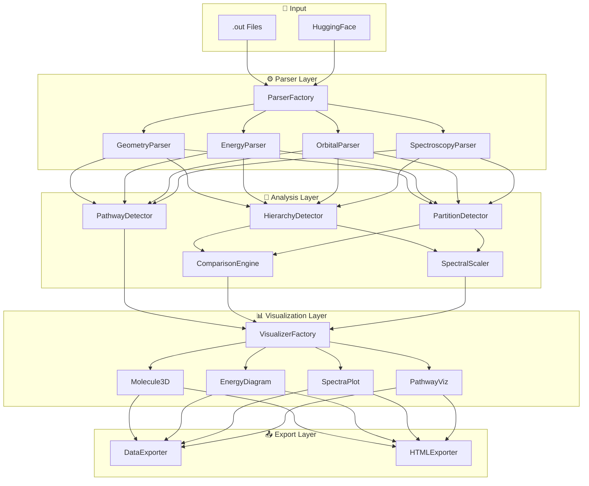
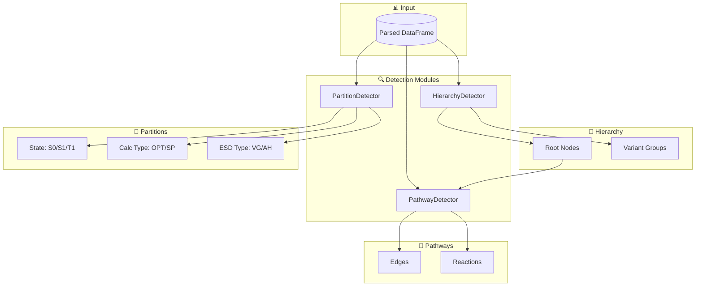
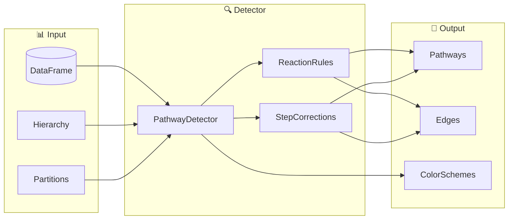

# ORCA Quantum Chemistry Visualization Platform

**An interactive Python-based parser and visualization system for ORCA quantum chemistry output files.**

> **Stack**: Streamlit + Plotly + py3Dmol | **Deployment**: Local

---

## 📋 Key Features

| Feature | Description |
|---------|-------------|
| **Modular Parser** | Data-type based parsers with logging |
| **Interactive Viz** | Plotly + py3Dmol visualizations |
| **Multi-Comparison** | Compare multiple molecules side-by-side |
| **Hierarchy Detection** | Auto-detect data hierarchy from naming |
| **Partition Detection** | Auto-detect data partitions (S0/S1/T1, OPT/SP) |
| **Pathway Detection** | Auto-detect degradation pathways |
| **Spectral Scaling** | Linear & relative frequency scaling |
| **Data Export** | Export parsed data (JSON, CSV, Parquet) |
| **HTML Export** | Single-file interactive reports |

---

## 🏗️ System Architecture



---

### Data Detection Architecture



**Partition Detection Example:**
```python
detector = PartitionDetector(df)
partitions = detector.detect()

# Output:
# {
#   "by_state": {"S0": [...], "S1": [...], "T1": [...]},
#   "by_calc_type": {"OPT": [...], "SP": [...]},
#   "by_esd_type": {"VG": [...], "AH": [...], "AHAS": [...]}
# }
```

---

### Pathway Detection Architecture



---

## 📁 Project Structure

```
Orca_Files/
├── app.py
├── src/
│   ├── parser/
│   │   ├── factory.py
│   │   ├── geometry.py
│   │   ├── energy.py
│   │   ├── orbitals.py
│   │   └── spectroscopy.py
│   │
│   ├── analysis/
│   │   ├── hierarchy_detector.py
│   │   ├── partition_detector.py    # NEW
│   │   ├── pathway_detector.py
│   │   ├── comparison_engine.py
│   │   └── spectral_scaler.py
│   │
│   ├── viz/
│   │   ├── molecule_3d.py
│   │   ├── energy_diagram.py
│   │   ├── spectra_plot.py
│   │   └── pathway_viz.py
│   │
│   └── export/
│       ├── data_exporter.py
│       └── html_exporter.py
│
└── tests/
```

---

## 🔬 Detection APIs

### Hierarchy
```python
hd = HierarchyDetector(df)
hierarchy = hd.detect()
# p1x, p1a → p1 (root) with variants
```

### Partition
```python
pd = PartitionDetector(df)
partitions = pd.detect()
# by_state, by_calc_type, by_esd_type
```

### Pathway
```python
pwd = PathwayDetector(df, hierarchy, partitions)
pwd.set_reaction_rules({...})
pathways = pwd.detect()
```

---

## 📤 Export APIs

### Data
```python
exporter = DataExporter(df)
exporter.to_json("data.json")
exporter.to_csv("data.csv")
exporter.to_parquet("data.parquet")
```

### HTML
```python
exporter = HTMLExporter(df)
exporter.add_all_visualizations()
exporter.export("report.html")
```

---

## 🚀 Quick Start

```bash
pip install -r requirements.txt
streamlit run app.py
```

[](https://colab.research.google.com/github/jauharmz/Orca_Files/blob/main/ORCA_Test_v2.ipynb)

---

*Last Updated: 2026-01-02*
