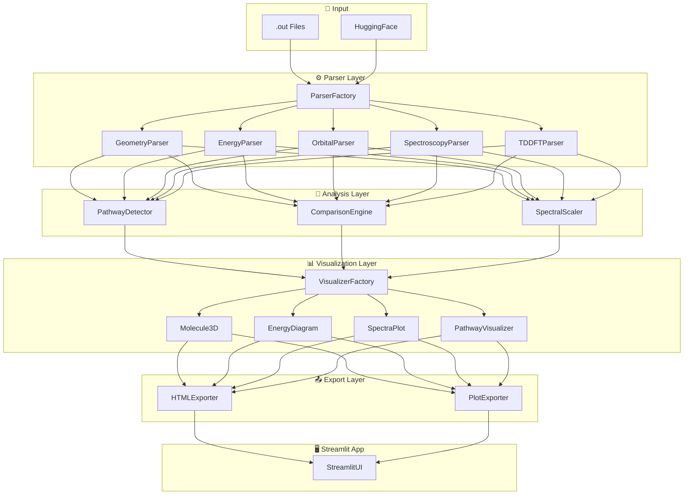
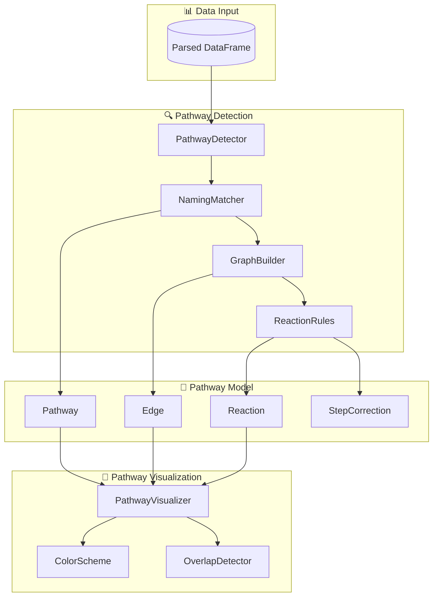
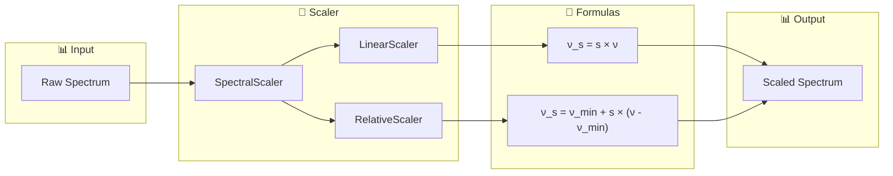
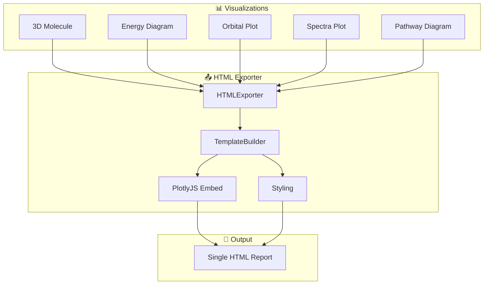

# ORCA Quantum Chemistry Visualization Platform

**An interactive Python-based parser and visualization system for ORCA quantum chemistry output files.**

> **Stack**: Streamlit + Plotly + py3Dmol | **Deployment**: Local | **User**: Single-user

---

## 📋 Key Features

| Feature | Description |
|---------|-------------|
| **Modular Parser** | Data-type based parsers with logging |
| **Interactive Viz** | Plotly + py3Dmol visualizations |
| **Multi-Comparison** | Compare multiple molecules side-by-side |
| **Pathway Detection** | Auto-detect degradation pathways |
| **Spectral Scaling** | Linear & relative frequency scaling |
| **HTML Export** | Single-file interactive reports |

---

## 🏗️ System Architecture

### High-Level Overview



---

### Pathway Detection & Comparison Architecture



---

### Spectral Scaling Architecture



---

### HTML Export Architecture



---

## 📁 Project Structure

```
Orca_Files/
├── app.py
├── requirements.txt
│
├── src/
│   ├── core/
│   │   ├── base_parser.py
│   │   ├── base_visualizer.py
│   │   └── data_models.py
│   │
│   ├── parser/
│   │   ├── factory.py
│   │   ├── geometry.py
│   │   ├── energy.py
│   │   ├── orbitals.py
│   │   ├── spectroscopy.py
│   │   ├── tddft.py
│   │   └── batch.py
│   │
│   ├── analysis/                    # NEW: Analysis modules
│   │   ├── __init__.py
│   │   ├── pathway_detector.py      # Auto-detect pathways
│   │   ├── comparison_engine.py     # Multi-molecule comparison
│   │   ├── spectral_scaler.py       # Linear/relative scaling
│   │   └── reaction_rules.py        # Reaction definitions
│   │
│   ├── viz/
│   │   ├── factory.py
│   │   ├── molecule_3d.py
│   │   ├── energy_diagram.py
│   │   ├── orbital_plot.py
│   │   ├── spectra_plot.py
│   │   └── pathway_viz.py           # NEW: Pathway visualization
│   │
│   ├── export/                      # NEW: Export modules
│   │   ├── __init__.py
│   │   ├── html_exporter.py         # Single HTML report
│   │   ├── plot_exporter.py         # PNG/SVG export
│   │   └── templates/
│   │       └── report.html
│   │
│   └── ui/
│       ├── pages/
│       │   ├── home.py
│       │   ├── upload.py
│       │   ├── molecule.py
│       │   ├── compare.py           # NEW: Comparison page
│       │   └── pathway.py           # NEW: Pathway page
│       └── components/
│
└── tests/
```

---

## 🔬 Advanced Features

### 1. Pathway Detection

```python
# Auto-detect degradation pathways from molecule IDs
detector = PathwayDetector(df)
pathways = detector.detect()

# Output:
# [
#   Pathway(nodes=["p1x", "p2x", "p3x", "p4x", "p5x"]),
#   Pathway(nodes=["p1x", "p6x"]),
#   Pathway(nodes=["p1x", "p1a", "p2a", ...]),
# ]

# Define reaction rules
detector.set_reaction_rules({
    ("p1", "p2"): {"add": {"OH": 4}, "remove": {"H2O": 3}},
    ("p2", "p3"): {"add": {"OH": 2}, "remove": {"H2O": 1}},
    ("p3", "p4"): {"remove": {"CO2": 1}},
    ("p4", "p5"): {"add": {"OH": 1}, "remove": {"HCO3": 1}},
    ("p1", "p6"): {"add": {"OH": 1}, "remove": {"H2O": 1, "OMe": 1}},
})

# Color schemes
detector.set_color_scheme("by_variant")  # or "by_destination"
```

### 2. Multi-Comparison

```python
# Compare multiple molecules
engine = ComparisonEngine(df)
comparison = engine.compare(["p1x", "p2x", "p3x"], 
                            properties=["energy", "orbitals", "spectra"])

# Side-by-side visualization
fig = engine.create_comparison_figure()
```

### 3. Spectral Scaling

```python
scaler = SpectralScaler(spectrum_df)

# Linear scaling: ν_s = s × ν
scaled_linear = scaler.linear_scale(factor=0.97)

# Relative scaling: ν_s = ν_min + s × (ν - ν_min)
scaled_relative = scaler.relative_scale(factor=1.5)
```

| Scale Type | Formula | Use Case |
|------------|---------|----------|
| Linear | `ν_s = s × ν` | DFT frequency correction |
| Relative | `ν_s = ν_min + s(ν - ν_min)` | Visual comparison |

### 4. HTML Report Export

```python
exporter = HTMLExporter(df)
exporter.add_molecule_3d(mol_id="p1x")
exporter.add_energy_diagram(mol_ids=["p1x", "p2x"])
exporter.add_pathway_diagram(pathways)
exporter.add_spectra_plot(mol_id="p1x", spectrum_type="ir")

# Export single interactive HTML
exporter.export("report.html")
```

---

## 🧪 Tests

```bash
# Run all tests with output
pytest tests/ -v -s

# Run specific module
pytest tests/test_pathway_detector.py -v
```

---

## 🚀 Quick Start

```bash
pip install -r requirements.txt
streamlit run app.py
```

[](https://colab.research.google.com/github/jauharmz/Orca_Files/blob/main/ORCA_Test_v2.ipynb)

---

*Last Updated: 2026-01-02*
