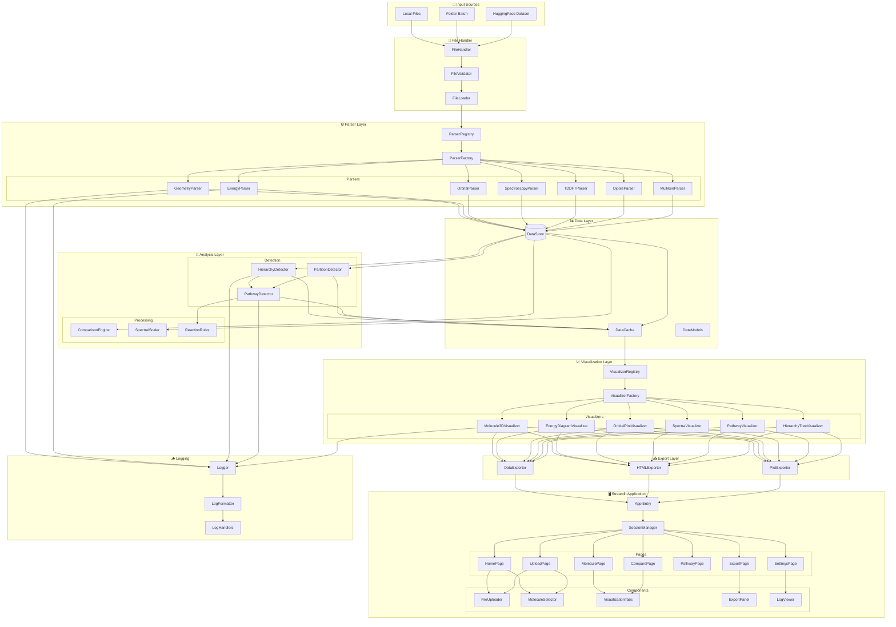
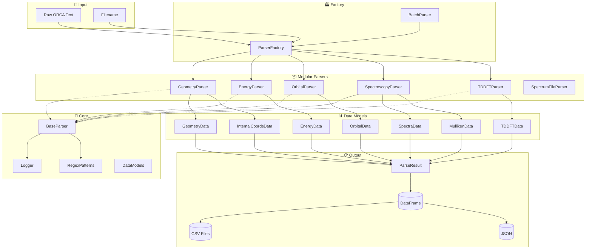
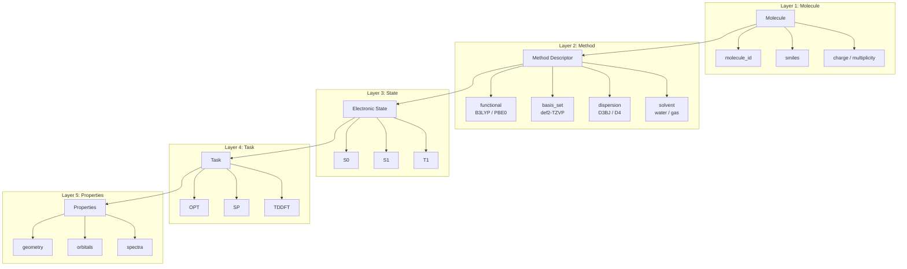
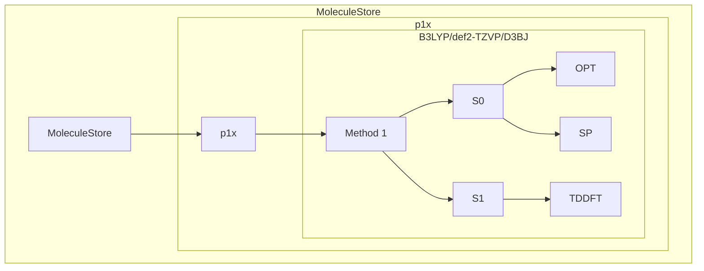
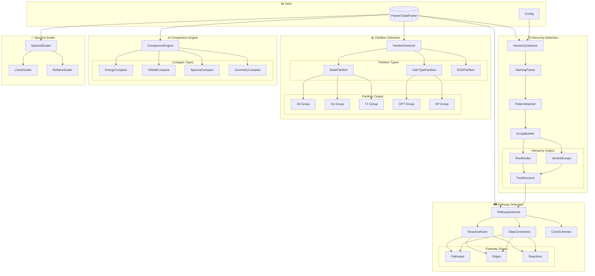
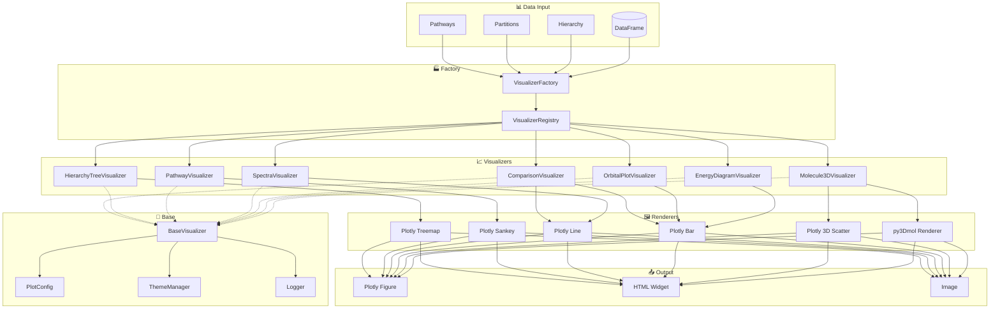
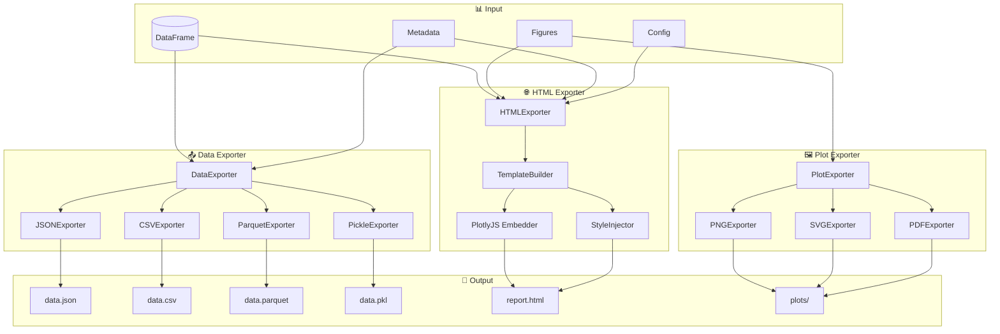
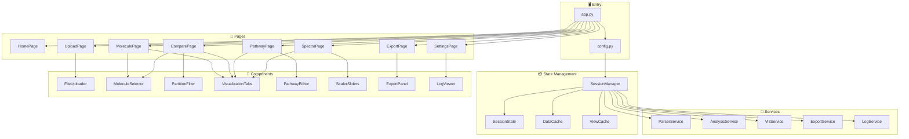
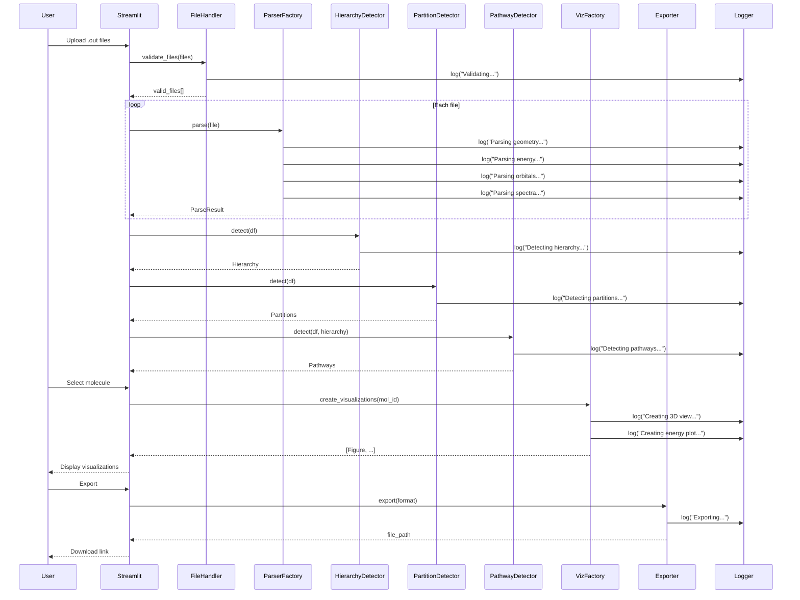

# ORCA Quantum Chemistry Visualization Platform

**An interactive Python-based parser and visualization system for ORCA quantum chemistry output files.**

> **Stack**: Streamlit + Plotly + py3Dmol | **Deployment**: Local | **Logging**: Full debug support

---

## 📋 Key Features

| Feature | Description |
|---------|-------------|
| **Modular Parser** | Data-type based parsers (geometry, energy, orbitals, spectroscopy, tddft, dipole, mulliken) |
| **Hierarchy Detection** | Auto-detect molecule hierarchy from naming patterns (p1x, p1a, p1b → p1 root) |
| **Partition Detection** | Auto-detect partitions by state (S0/S1/T1), calc type (OPT/SP), ESD type (VG/AH/AHAS) |
| **Pathway Detection** | Auto-detect degradation pathways with reaction rules and step corrections |
| **Multi-Comparison** | Compare multiple molecules side-by-side |
| **Spectral Scaling** | Linear (`ν_s = s × ν`) and relative (`ν_s = ν_min + s(ν - ν_min)`) scaling |
| **Data Export** | Export parsed data to JSON, CSV, Parquet, Pickle |
| **HTML Export** | Single-file interactive reports with embedded Plotly.js |
| **Interactive Viz** | Plotly charts + py3Dmol 3D molecular viewer |

---

## 🏗️ System Architecture

### Complete System Overview



---

### Parser Module Architecture

The modular parser is refactored from `orca_praser.py` into independent, focused modules:



#### Data Components (28 fields)

| Category | Field | Source Module | Description |
|----------|-------|---------------|-------------|
| **Identity** | molecule_id | batch.py | Extracted from filename |
| | smiles | geometry.py | SMILES from coordinates |
| | charge | geometry.py | Molecular charge |
| | multiplicity | geometry.py | Spin multiplicity |
| **Energy** | gibbs_Eh | energy.py | Gibbs free energy (Eh) |
| | single_point_Eh | energy.py | Single-point energy (Eh) |
| **Orbitals** | homo_energy | orbitals.py | HOMO energy (eV) |
| | lumo_energy | orbitals.py | LUMO energy (eV) |
| | homo_lumo_gap | orbitals.py | HOMO-LUMO gap (eV) |
| | orbitals | orbitals.py | Full orbital DataFrame |
| **Geometry** | cart_coords | geometry.py | Cartesian coordinates |
| | bonds | geometry.py | Internal bond coords |
| | angles | geometry.py | Internal angle coords |
| | dihedrals | geometry.py | Internal dihedral coords |
| **Spectroscopy** | ir | spectroscopy.py | IR spectrum |
| | vibrations | spectroscopy.py | Vibrational frequencies |
| | raman | spectroscopy.py | Raman spectrum |
| | mulliken | spectroscopy.py | Mulliken charges |
| | nmr_shielding | spectroscopy.py | NMR chemical shielding |
| | nmr_coupling | spectroscopy.py | NMR J-coupling |
| **TD-DFT** | tddft_states | tddft.py | Excited states |
| | electric_dipole_abs | tddft.py | Electric dipole absorption |
| | electric_dipole_soc | tddft.py | Electric dipole SOC |
| | velocity_dipole_abs | tddft.py | Velocity dipole absorption |
| | velocity_dipole_soc | tddft.py | Velocity dipole SOC |
| **Method** | method_id | method.py | Composite method identifier |
| | functional | method.py | XC functional (B3LYP, PBE0...) |
| | basis_set | method.py | Basis set (def2-TZVP...) |
| | dispersion | method.py | Dispersion (D3BJ, D4...) |
| | solvent | method.py | Solvent (water, ethanol...) |
| **Metadata** | is_optimization | energy.py | Optimization calc? |
| | optimized_state | energy.py | S0, S1, T1 |
| | calc_class | energy.py | single_point/optimization/tddft |
| | esd_type | energy.py | VG/AH/AHAS spectrum type |

---

### 🧬 ORCA Data Architecture

> **Core Principle**: ORCA does not produce files — it produces solutions to Hamiltonians under specific approximations.

The data architecture ensures scientifically correct storage while providing ergonomic access for analysis.

#### The Five Architectural Layers



#### Method Descriptor (Layer 2)

A method is defined by a **composite descriptor**, not a single keyword:

| Dimension | Examples |
|-----------|----------|
| Formalism | DFT, HF, MP2, CCSD, CASSCF |
| Functional | B3LYP, ωB97X, PBE0 |
| Basis set | def2-SVP, def2-TZVP, def2-QZVP |
| Dispersion | D3BJ, D4, none |
| Relativistic | none, ZORA, DKH, X2C |
| Environment | gas, CPCM, SMD |
| Solvent | water, ethanol, acetonitrile |

> **Changing any of these creates a new method.**

#### MoleculeStore: Hierarchical Storage



#### Storage vs Access

| Layer | Purpose | Example |
|-------|---------|---------|
| **Storage** | Full data, all methods, reproducibility | `store._data[mol][method][state][task]` |
| **Access** | Simple queries, canonical projection | `store.get("p1x")` → best result |

#### Canonical Projection

For simple analysis, the system auto-selects the "canonical" (best) result:

- **State priority**: S0 > S1 > T1
- **Task priority**: OPT > SP > TDDFT
- **Basis priority**: def2-QZVP > def2-TZVP > def2-SVP

```python
# Simple access (uses projection)
store = MoleculeStore()
result = store.get("p1x")  # Returns canonical result

# Explicit access (for comparison)
result = store.get("p1x", method_id="DFT/B3LYP/def2-TZVP/D3BJ", state="S0")
```

#### Architectural Principles

1. **Method identity is composite** - not a single keyword
2. **Filenames are never identity** - molecule_id is extracted
3. **States are not identity** - S0 from method A ≠ S0 from method B
4. **Storage reflects physics** - all methods preserved
5. **Access reflects thinking** - simple queries return projected view
6. **Projection is mandatory** - hides complexity by default
7. **Method awareness is opt-in** - explicit only when comparing

---

### Detection & Analysis Architecture



---

### Visualization Architecture



---

### Export Architecture



---

### Streamlit Application Architecture



---

### Data Flow Sequence



---

## 📁 Project Structure

```
Orca_Files/
├── README.md                           # This file
├── requirements.txt                    # Dependencies
├── app.py                              # Streamlit entry
│
├── src/
│   ├── __init__.py
│   ├── config.py                       # Global config
│   ├── logger.py                       # Logging setup
│   │
│   ├── core/                           # Core abstractions
│   │   ├── __init__.py
│   │   ├── base_parser.py              # BaseParser ABC
│   │   ├── base_visualizer.py          # BaseVisualizer ABC
│   │   ├── data_models.py              # Pydantic models
│   │   ├── exceptions.py               # Custom exceptions
│   │   └── registry.py                 # Registry pattern
│   │
│   ├── parser/                         # Parser modules (refactored from orca_praser.py)
│   │   ├── __init__.py                 # Package exports
│   │   ├── factory.py                  # ParserFactory - orchestrates all parsers
│   │   ├── batch.py                    # BatchParser - multi-file with molecule grouping
│   │   ├── geometry.py                 # Coords, SMILES, internal coords (B/A/D)
│   │   ├── energy.py                   # Gibbs, SP energy, ESD flag, calc type
│   │   ├── orbitals.py                 # HOMO/LUMO, spin handling, orbital levels
│   │   ├── spectroscopy.py             # IR, Raman, Mulliken, NMR
│   │   ├── tddft.py                    # TD-DFT states, dipole spectra, H→L labels
│   │   ├── spectrum_file.py            # External spectrum files (VG/AH/AHAS/FLUOR)
│   │   └── regex_patterns.py           # Shared regex patterns
│   │
│   ├── analysis/                       # Analysis modules
│   │   ├── __init__.py
│   │   ├── hierarchy_detector.py       # Root/variant groups
│   │   ├── partition_detector.py       # S0/S1, OPT/SP
│   │   ├── pathway_detector.py         # Degradation paths
│   │   ├── reaction_rules.py           # Add/remove rules
│   │   ├── comparison_engine.py        # Multi-compare
│   │   └── spectral_scaler.py          # Linear/relative
│   │
│   ├── viz/                            # Visualization modules
│   │   ├── __init__.py
│   │   ├── factory.py                  # VisualizerFactory
│   │   ├── config.py                   # Plot themes
│   │   ├── molecule_3d.py              # py3Dmol + Plotly 3D
│   │   ├── energy_diagram.py           # Energy bars
│   │   ├── orbital_plot.py             # Orbital levels
│   │   ├── spectra_plot.py             # IR/Raman/UV-Vis
│   │   ├── pathway_viz.py              # Pathway network
│   │   ├── hierarchy_tree.py           # Tree view
│   │   └── comparison_viz.py           # Side-by-side
│   │
│   ├── export/                         # Export modules
│   │   ├── __init__.py
│   │   ├── data_exporter.py            # JSON/CSV/Parquet
│   │   ├── html_exporter.py            # Interactive HTML
│   │   ├── plot_exporter.py            # PNG/SVG
│   │   └── templates/
│   │       └── report.html             # HTML template
│   │
│   ├── services/                       # Business logic
│   │   ├── __init__.py
│   │   ├── parser_service.py           # Parsing orchestration
│   │   ├── analysis_service.py         # Analysis orchestration
│   │   ├── viz_service.py              # Viz orchestration
│   │   └── export_service.py           # Export orchestration
│   │
│   ├── ui/                             # Streamlit UI
│   │   ├── __init__.py
│   │   ├── session_manager.py          # State management
│   │   ├── pages/
│   │   │   ├── __init__.py
│   │   │   ├── home.py
│   │   │   ├── upload.py
│   │   │   ├── molecule.py
│   │   │   ├── compare.py
│   │   │   ├── pathway.py
│   │   │   ├── spectra.py
│   │   │   ├── export.py
│   │   │   └── settings.py
│   │   └── components/
│   │       ├── __init__.py
│   │       ├── file_uploader.py
│   │       ├── molecule_selector.py
│   │       ├── partition_filter.py
│   │       ├── viz_tabs.py
│   │       ├── pathway_editor.py
│   │       ├── scaler_sliders.py
│   │       ├── export_panel.py
│   │       └── log_viewer.py
│   │
│   └── utils/                          # Utilities
│       ├── __init__.py
│       ├── converters.py               # Unit conversions
│       ├── validators.py               # Input validation
│       └── helpers.py                  # General helpers
│
├── tests/                              # Test suite
│   ├── __init__.py
│   ├── README.md                       # Test documentation
│   ├── test_comprehensive.py           # Full parser test → 16 CSV exports
│   ├── test_original_parser.py         # Original orca_praser.py test
│   ├── test_comparison.py              # Side-by-side parser comparison
│   ├── test_visualizations.py          # Visualization tests → HTML plots
│   ├── test_parsers.py                 # Unit tests for parsers
│   ├── test_analysis.py                # Analysis module tests
│   └── test_real.py                    # Integration tests
│
├── notebooks/                          # Demo notebooks
│   ├── 01_parser_demo.ipynb
│   ├── 02_analysis_demo.ipynb
│   └── 03_viz_demo.ipynb
│
├── orca_praser.py                      # Original reference parser
└── requirements.txt                    # Dependencies
```

### CSV Export Structure

When running `python tests/test_comprehensive.py`, up to 16 CSV files are generated:

| File | Contents | Rows |
|------|----------|------|
| `parsed_molecules.csv` | Scalar data + counts | 1 per molecule |
| `parsed_cart_coords.csv` | x, y, z coordinates | All atoms |
| `parsed_orbitals.csv` | OCC, Eh, eV, spin, lvl | All orbitals |
| `parsed_tddft_states.csv` | Excited state transitions | All states |
| `parsed_ir_spectra.csv` | freq, eps, intensity | All IR peaks |
| `parsed_vibrations.csv` | freq, imaginary flag | All modes |
| `parsed_raman.csv` | freq, activity, depolarization | All peaks |
| `parsed_mulliken.csv` | Nucleus, Element, Pop, Charge | All atoms |
| `parsed_nmr_shielding.csv` | Isotropic, Anisotropy | All nuclei |
| `parsed_nmr_coupling.csv` | Nucleus1, Nucleus2, J_Hz | All couplings |
| `parsed_internal_bonds.csv` | Bond definitions, values | All bonds |
| `parsed_internal_angles.csv` | Angle definitions, values | All angles |
| `parsed_internal_dihedrals.csv` | Dihedral definitions, values | All dihedrals |
| `parsed_electric_dipole.csv` | Absorption spectrum | All transitions |
| `parsed_velocity_dipole.csv` | Velocity dipole spectrum | All transitions |
| `parsed_data.json` | Complete nested data | All data |

---

## 🔬 API Reference

### Parser

```python
from src.parser.factory import ParserFactory

factory = ParserFactory()
result = factory.parse("molecule.out")

# Access parsed data
coords = result.geometry.cart_coords
energy = result.energy.gibbs_Eh
orbitals = result.orbitals.homo_lumo
```

### Hierarchy Detection

```python
from src.analysis.hierarchy_detector import HierarchyDetector

detector = HierarchyDetector(df)
hierarchy = detector.detect()

# p1x, p1a, p1b → p1 (root) with variants x, a, b
print(hierarchy.to_tree())
```

### Partition Detection

```python
from src.analysis.partition_detector import PartitionDetector

detector = PartitionDetector(df)
partitions = detector.detect()

# {"by_state": {"S0": [...], "S1": [...]}, 
#  "by_calc_type": {"OPT": [...], "SP": [...]}}
```

### Pathway Detection

```python
from src.analysis.pathway_detector import PathwayDetector

detector = PathwayDetector(df, hierarchy)
detector.set_reaction_rules({
    ("p1", "p2"): {"add": {"OH": 4}, "remove": {"H2O": 3}},
    ("p2", "p3"): {"add": {"OH": 2}, "remove": {"H2O": 1}},
})
detector.set_step_corrections({
    ("p1x", "p1a"): {"add": {"OH": 2}, "remove": {"H2O": 1}},
})
detector.set_color_scheme("by_variant")
pathways = detector.detect()
```

### Spectral Scaling

```python
from src.analysis.spectral_scaler import SpectralScaler

scaler = SpectralScaler(spectrum_df)

# Linear: ν_s = s × ν
linear = scaler.linear_scale(factor=0.97)

# Relative: ν_s = ν_min + s × (ν - ν_min)
relative = scaler.relative_scale(factor=1.5)
```

### Data Export

```python
from src.export.data_exporter import DataExporter

exporter = DataExporter(df, metadata=metadata)
exporter.to_json("data.json")
exporter.to_csv("data.csv")
exporter.to_parquet("data.parquet")
exporter.export_bundle("results/")  # All formats + metadata
```

### HTML Export

```python
from src.export.html_exporter import HTMLExporter

exporter = HTMLExporter(df)
exporter.add_molecule_3d("p1x")
exporter.add_energy_diagram(["p1x", "p2x", "p3x"])
exporter.add_pathway_diagram(pathways)
exporter.add_spectra("p1x", spectrum_type="ir")
exporter.export("report.html")
```

---

## 🪵 Logging

```python
# src/logger.py configuration
LOG_FORMAT = '%(asctime)s | %(name)s | %(levelname)s | %(message)s'

# Levels: DEBUG, INFO, WARNING, ERROR
# Output: Console + orca_viz.log file
```

---

## 🚀 Quick Start

```bash
# Install
pip install -r requirements.txt

# Parse with modular parser (exports 16 CSVs)
python tests/test_comprehensive.py

# Parse with original parser (for comparison)
python tests/test_original_parser.py

# Compare both parsers
python tests/test_comparison.py

# Generate visualization HTML
python tests/test_visualizations.py

# Run unit tests
pytest tests/ -v -s

# Run Streamlit app
streamlit run app.py
```

[](https://colab.research.google.com/github/jauharmz/Orca_Files/blob/main/ORCA_Test_v2.ipynb)

---

## 🤗 HuggingFace

```python
from huggingface_hub import snapshot_download

snapshot_download(
    repo_id="JauharMz/Orca",
    repo_type="dataset",
    local_dir="./data"
)
```

---

*Last Updated: 2026-01-03*
